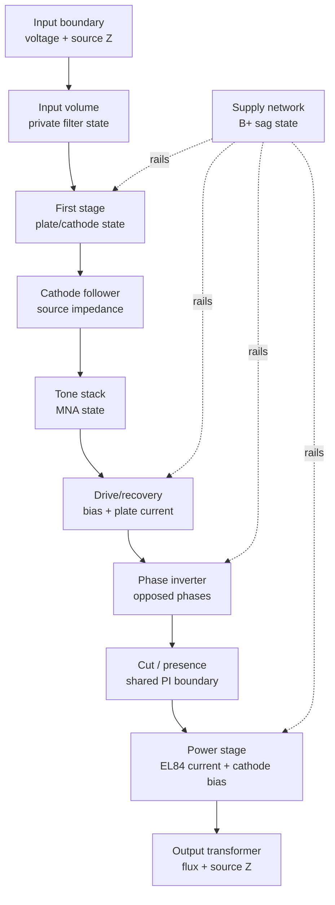

Greybound can carry more than one implementation of the same amp while keeping a
single musical UX. This is the intended workflow for moving Nox30 toward more
circuit-derived behavior without risking the desktop feel that currently works.

## Goals

- Keep `nox30` as the stable, playable reference.
- Add `nox30-experimental` as the development target for circuit-description,
  component-boundary, and shared-state experiments.
- Let the desktop switch implementations without changing controls, pedals,
  cab, audio devices, or the visible UX.
- Let the lab render both implementations with fixed conditions and compare
  runtime health, WAV metrics, and listening notes.
- Make the experiment reversible: if the experimental model is worse, the stable
  desktop path remains untouched.

## Non-Goals

- The UI switch is not a rig-field replacement. It is a runtime/developer choice
  for the desktop app.
- The experimental model is not automatically more correct because it exposes
  more circuit structure.
- Circuit descriptors do not become full SPICE netlists by default.
- Component state must not be shared by letting one stage mutate another stage's
  private DSP memory.

## Current Implementation

The desktop top bar exposes a runtime switch:

- `AMP STABLE` loads `nox30`.
- `AMP EXPERIMENT` loads `nox30-experimental`.

Switching implementations restarts the live audio engine because the amp core
owns stateful filters, nonlinear solvers, sag memory, and transformer memory.
Controls, selected devices, cab mix, metronome state, tuner state, and audio
device selection stay in the UI state and are copied into the new runtime.

`nox30-experimental` is a distinct core variant that currently delegates audio
processing to the stable Nox30 stages through an experimental boundary runner.
It is intentionally bit-equivalent to `nox30` until a focused component
experiment diverges it. The runner records the latest component boundary states
so future replacements have an explicit state path before they alter sound.

Offline A/B uses:

- `rigs/grey-nox.json5`
- `rigs/grey-nox-experimental.json5`

These rigs should stay identical except for `amp.model` unless the experiment is
explicitly about topology or control settings.

## Source-Of-Truth Levels

Greybound should separate three layers that are easy to confuse:

1. **Circuit description**
   Runtime semantic graph describing stages, ports, controls, confidence, and
   implementation mapping. This is the source of truth for UI circuit views,
   lab inspection, documentation, and future executable graph work.

2. **Executable amp implementation**
   Rust DSP code that turns audio and controls into audio. This owns private
   stage memory and produces telemetry. The stable implementation may remain
   hand-structured while the experimental implementation becomes more
   descriptor-driven.

3. **Validation artifacts**
   Monitor logs, WAV renders, comparison reports, SPICE fixtures, and measured
   references. These decide whether the experimental implementation is useful.

The circuit description can become the orchestration source of truth before it
becomes a physical netlist. That means it can say which stages exist, how they
connect, and what state crosses a boundary, while individual stages still use
hand-written Rust cells.

## Component State Contract

Stages keep private state private. A stage can expose and consume only boundary
state that is meaningful outside the stage.

Boundary state should be explicit and typed. The shared state vocabulary is:

- `voltage_v`: signal voltage at the boundary.
- `source_impedance_ohms`: impedance presented downstream.
- `load_impedance_ohms`: impedance expected or imposed upstream.
- `coupling`: DC-coupled, AC-coupled, buffered, transformer-like, or unknown.
- `dc_offset_v`: DC operating offset that can affect the next nonlinear stage.
- `headroom_v`: approximate remaining voltage headroom.
- `nominal_level_v`: recent nominal level for gain staging.
- `peak_level_v`: recent peak level for overload diagnostics.
- `latency_samples`: local latency contributed by the component boundary.
- `warnings`: impedance mismatch, clipping risk, unstable bias, denormal risk,
  silence, runaway level, or unsupported operating point.

The current `ConnectionState`, `ElectricalSignal`, and `Load` types are the first
small version of this idea: they model source/load voltage division and cable
capacitance between devices. The amp experiment should extend that principle
inside Nox30 component boundaries instead of letting stages poke each other's
private members.

## Nox30 Experimental Shape

The experimental amp should start as a wrapper around the same conceptual
boundaries already documented by `NOX30_COMPONENT_BOUNDARIES`:

- input volume and bright bypass,
- first ECC83 common-cathode stage,
- cathode follower,
- Top Boost tone stack,
- drive and recovery stages,
- long-tail-pair phase inverter,
- cut/presence network,
- EL84 push-pull power stage,
- B+ sag network,
- output transformer.

The recommended internal direction is:



The supply network is a shared component dependency, not a normal audio-series
block. It should consume current demands from stages and publish rail voltages
back to the next sample or block according to the selected numerical strategy.
That makes rail sag explicit without turning every stage into global mutable
state.

## Migration Plan

1. **Alias baseline**
   `nox30-experimental` maps to the same implementation as `nox30`, with a test
   proving bit-equivalence.

2. **Descriptor mirror**
   Add an amp `CircuitDescriptor` equivalent to the current Nox30 component
   boundaries. UI and lab inspection read this descriptor; DSP remains unchanged.

3. **Boundary telemetry**
   Make the stable model expose per-boundary telemetry using the shared-state
   vocabulary where possible. The telemetry is observational and must not alter
   audio.

4. **Experimental boundary runner**
   Introduce an experimental runner that processes explicit component boundary
   states in the documented order. Initially it wraps the existing stages and
   observes their boundary states, preserving bit-equivalence.

5. **Selective replacement**
   Replace one component at a time with a more physical cell, starting with the
   component that has the clearest validation target. Tone stack and coupling
   boundaries are better first candidates than the whole power section.

6. **Promotion**
   Promote only when lab evidence improves the target behavior without worse
   runtime health or worse desktop feel.

## Lab Protocol

Build release first:

```bash
cargo build --release
```

Render stable:

```bash
target/release/greybound-cli \
  --rig rigs/grey-nox.json5 \
  --input-wav "lab/references/tone3000-inputs/Brit - Guitar.wav" \
  --output-wav target/grey-nox-stable.wav \
  --render-seconds 10 \
  --sample-rate 48000 \
  --period-size 32 \
  --ir lab/references/tone3000-irs/celestion.wav \
  --monitor
```

Render experimental:

```bash
target/release/greybound-cli \
  --rig rigs/grey-nox-experimental.json5 \
  --input-wav "lab/references/tone3000-inputs/Brit - Guitar.wav" \
  --output-wav target/grey-nox-experimental.wav \
  --render-seconds 10 \
  --sample-rate 48000 \
  --period-size 32 \
  --ir lab/references/tone3000-irs/celestion.wav \
  --monitor
```

The only expected difference in the alias phase is metadata naming. Audio should
remain equivalent until a real experimental component diverges.

When a component changes, compare:

- monitor health: xrun, silence, hard clipping, near clipping, denormals,
  runaway levels,
- gain and latency alignment,
- RMS, peak, and crest factor,
- band residual and log-spectral distance,
- envelope and attack diagnostics,
- harmonic/intermodulation tests for nonlinear stage changes,
- sag and recovery tests for power-supply or bias changes.

## Acceptance Gates

An experimental amp change can be kept only if it states:

- which component boundary changed,
- what shared state it consumes and exposes,
- whether private state was added and where it lives,
- what validation target was used,
- exact render commands,
- monitor verdict,
- metric deltas,
- audible interpretation,
- regressions and remaining assumptions.

If the change cannot name the voltage, current, impedance, coupling, or
telemetry meaning of a new boundary value, treat it as a greybox approximation
and validate it as such.
