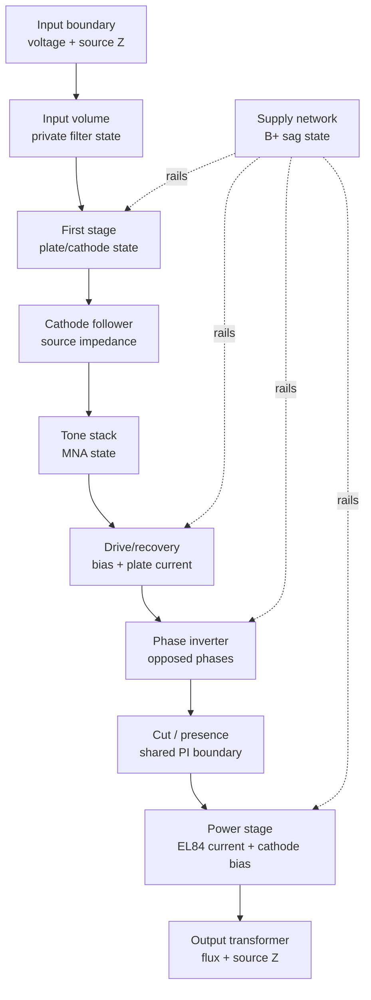

This page records the temporary A/B workflow that was used to move Nox30 toward
explicit component-boundary behavior. As of 2026-07-02, the formerly
experimental Nox30 path is the canonical implementation. `nox30-experimental`
is retained only as a legacy rig alias.

Future experiments can still use the pattern below, but they should be
introduced as short-lived named hypotheses and promoted or removed after lab
evidence, rather than kept as a permanent product-facing stable/experimental
split.

## Goals

- Keep `nox30` as the playable reference while a candidate is being evaluated.
- Let a short-lived development target carry circuit-description,
  component-boundary, and shared-state experiments.
- If a desktop switch is useful, make it a temporary development control that
  does not alter controls, pedals, cab, audio devices, or the visible UX.
- Let the lab render both implementations with fixed conditions and compare
  runtime health, WAV metrics, and listening notes.
- Make the experiment reversible until promotion; after promotion, remove the
  alternate implementation and keep only compatibility aliases when needed.

## Non-Goals

- The UI switch is not a rig-field replacement. It is a runtime/developer choice
  for the desktop app.
- The experimental model is not automatically more correct because it exposes
  more circuit structure.
- Circuit descriptors do not become full SPICE netlists by default.
- Component state must not be shared by letting one stage mutate another stage's
  private DSP memory.

## Current Implementation

There is no desktop amp implementation switch in the promoted path. `nox30`
loads `Nox30Current`, which owns the normal Nox30 stages plus a boundary runner
that records component state and routes the cathode-follower to Top Boost tone
stack through an explicit `ComponentSignal`.

`nox30-experimental` still parses as a legacy alias and maps to the same
`Nox30Current` implementation. It exists to keep older rigs and comparison
artifacts readable, not to select a separate audio path.

For lab-only boundary experiments, canonical `nox30` accepts query-style model
parameters. The default form remains:

```json5
amp: {
  model: "nox30",
}
```

The first supported parameters alter only the experimental follower-to-tone-stack
boundary:

```json5
amp: {
  model: "nox30?tone_source_ohms=47000&tone_load_ohms=47000",
}
```

`tone_source_ohms` changes the source impedance presented by the follower
boundary to the Top Boost tone stack. `tone_load_ohms` changes the downstream
load impedance used by the tone-stack solve. Values are clamped to
`1 ohm..10 Mohm`. These parameters are intentionally not exposed in the desktop
UX because they are hypothesis controls for lab comparison, not musical
controls.

Offline A/B uses:

- `rigs/grey-nox.json5`
- `rigs/grey-nox-experimental.json5`
- `rigs/grey-nox-experimental-tone-load.json5`

Historical `*-experimental` rigs are now compatibility fixtures. New
experiments should get explicit hypothesis names and should stay identical to
their baseline except for the parameter under test.

## Source-Of-Truth Levels

Greybound should separate three layers that are easy to confuse:

1. **Circuit description**
   Runtime semantic graph describing stages, ports, controls, confidence, and
   implementation mapping. This is the source of truth for UI circuit views,
   lab inspection, documentation, and future executable graph work.

2. **Executable amp implementation**
   Rust DSP code that turns audio and controls into audio. This owns private
   stage memory and produces telemetry. The current implementation may remain
   hand-structured while a short-lived candidate becomes more descriptor-driven
   during evaluation.

3. **Validation artifacts**
   Monitor logs, WAV renders, comparison reports, SPICE fixtures, and measured
   references. These decide whether a candidate is useful enough to promote.

The circuit description can become the orchestration source of truth before it
becomes a physical netlist. That means it can say which stages exist, how they
connect, and what state crosses a boundary, while individual stages still use
hand-written Rust cells.

## Component State Contract

Stages keep private state private. A stage can expose and consume only boundary
state that is meaningful outside the stage.

Boundary state should be explicit and typed. The shared state vocabulary is:

- `voltage_v`: signal voltage at the boundary.
- `source_impedance_ohms`: impedance presented downstream.
- `load_impedance_ohms`: impedance expected or imposed upstream.
- `coupling`: DC-coupled, AC-coupled, buffered, transformer-like, or unknown.
- `dc_offset_v`: DC operating offset that can affect the next nonlinear stage.
- `headroom_v`: approximate remaining voltage headroom.
- `nominal_level_v`: recent nominal level for gain staging.
- `peak_level_v`: recent peak level for overload diagnostics.
- `latency_samples`: local latency contributed by the component boundary.
- `warnings`: impedance mismatch, clipping risk, unstable bias, denormal risk,
  silence, runaway level, or unsupported operating point.

The current `ConnectionState`, `ElectricalSignal`, and `Load` types are the first
small version of this idea: they model source/load voltage division and cable
capacitance between devices. The amp experiment should extend that principle
inside Nox30 component boundaries instead of letting stages poke each other's
private members.

## Nox30 Experimental Shape

The experimental amp should start as a wrapper around the same conceptual
boundaries already documented by `NOX30_COMPONENT_BOUNDARIES`:

- input volume and bright bypass,
- first ECC83 common-cathode stage,
- cathode follower,
- Top Boost tone stack,
- drive and recovery stages,
- long-tail-pair phase inverter,
- cut/presence network,
- EL84 push-pull power stage,
- B+ sag network,
- output transformer.

The recommended internal direction is:



The supply network is a shared component dependency, not a normal audio-series
block. It should consume current demands from stages and publish rail voltages
back to the next sample or block according to the selected numerical strategy.
That makes rail sag explicit without turning every stage into global mutable
state.

## Migration Plan

1. **Alias baseline**
   A candidate id maps to the same implementation as `nox30`, with a test
   proving bit-equivalence.

2. **Descriptor mirror**
   Add an amp `CircuitDescriptor` equivalent to the current Nox30 component
   boundaries. UI and lab inspection read this descriptor; DSP remains unchanged.

3. **Boundary telemetry**
   Make the current model expose per-boundary telemetry using the shared-state
   vocabulary where possible. The telemetry is observational unless the
   experiment explicitly targets that boundary.

4. **Experimental boundary runner**
   Introduce an experimental runner that processes explicit component boundary
   states in the documented order. Initially it wraps the existing stages and
   observes their boundary states, preserving bit-equivalence. The first
   implemented boundary runner path is follower -> tone stack.

5. **Selective replacement**
   Replace one component at a time with a more physical cell, starting with the
   component that has the clearest validation target. Tone stack and coupling
   boundaries are better first candidates than the whole power section.

6. **Promotion**
   Promote only when lab evidence improves the target behavior without worse
   runtime health or worse desktop feel.

## Lab Protocol

Build release first:

```bash
cargo build --release
```

Render stable:

```bash
target/release/greybound-cli \
  --rig rigs/grey-nox.json5 \
  --input-wav "lab/references/tone3000-inputs/Brit - Guitar.wav" \
  --output-wav target/grey-nox-stable.wav \
  --render-seconds 10 \
  --sample-rate 48000 \
  --period-size 32 \
  --ir lab/references/tone3000-irs/celestion.wav \
  --monitor
```

Render experimental:

```bash
target/release/greybound-cli \
  --rig rigs/grey-nox-experimental.json5 \
  --input-wav "lab/references/tone3000-inputs/Brit - Guitar.wav" \
  --output-wav target/grey-nox-experimental.wav \
  --render-seconds 10 \
  --sample-rate 48000 \
  --period-size 32 \
  --ir lab/references/tone3000-irs/celestion.wav \
  --monitor
```

The only expected difference for plain `nox30-experimental` is metadata naming.
Audio should remain equivalent unless a model parameter explicitly selects a
divergent experimental hypothesis.

Render a loaded tone-stack boundary hypothesis by temporarily changing the rig
model to:

```json5
"nox30-experimental?tone_source_ohms=47000&tone_load_ohms=47000"
```

Then compare the candidate against both the stable render and plain
`nox30-experimental`. A useful report should state whether the altered boundary
improved tone-stack response or feel, and whether it introduced clipping,
silence, denormals, or worse monitor health.

When a component changes, compare:

- monitor health: xrun, silence, hard clipping, near clipping, denormals,
  runaway levels,
- gain and latency alignment,
- RMS, peak, and crest factor,
- band residual and log-spectral distance,
- envelope and attack diagnostics,
- harmonic/intermodulation tests for nonlinear stage changes,
- sag and recovery tests for power-supply or bias changes.

## Acceptance Gates

An experimental amp change can be kept only if it states:

- which component boundary changed,
- what shared state it consumes and exposes,
- whether private state was added and where it lives,
- what validation target was used,
- exact render commands,
- monitor verdict,
- metric deltas,
- audible interpretation,
- regressions and remaining assumptions.

If the change cannot name the voltage, current, impedance, coupling, or
telemetry meaning of a new boundary value, treat it as a greybox approximation
and validate it as such.
